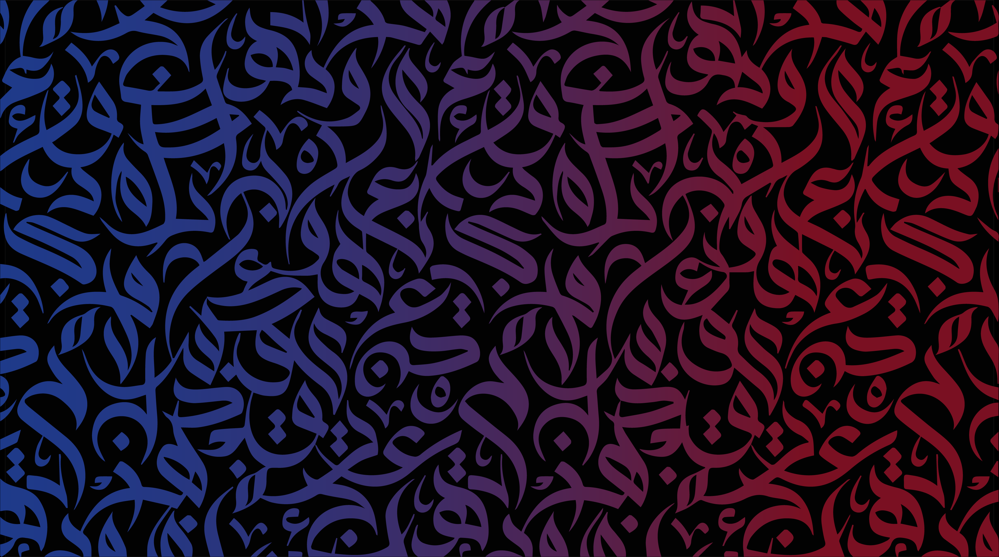
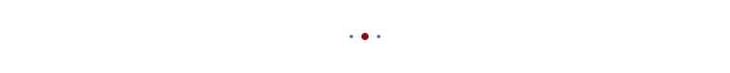
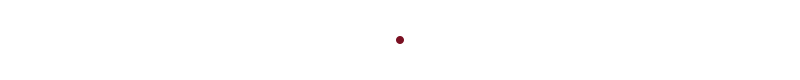
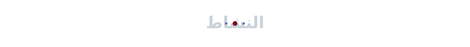
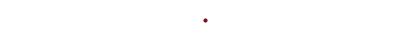

  
  

  

 

# عمر محمد زكريا الكيالي
### Omar ALKayyali

**Computer Science Student • Software Engineer • AI & Automation Enthusiast • Cybersecurity Interested**

 

---

  <h2>🚀 أعمل حالياً على | Currently Building</h2>

  <b>أعمل حالياً على:</b>
   • منصة صفحة (Safha Platform)
   • نظام إدارة محتوى الفريق الإعلامي
   • أتمتة مهام الذكاء الاصطناعي
   • منتجات رقمية

 

  <b>Currently building:</b>
   • Safha Platform
   • Media Team CMS
   • AI Automation Workflows
   • Digital Products

---

  <h2>👤 نبذة عني | About Me</h2>
  

 

  <b>نبذة عني:</b>
   
  طالب علم حاسوب وشغوف بتطوير البرمجيات. مهتم بمجالات الذكاء الاصطناعي والأتمتة، وأعمل على بناء منتجات رقمية تلبي احتياجات حقيقية. أمتلك خبرة في قيادة الفرق التقنية والعمل التطوعي والكشفي.

 

  <b>About Me:</b>
   
  Computer Science student and software engineering enthusiast. Passionate about AI and automation, building digital products that solve real-world problems. Experienced in technical team leadership and scout volunteering.

---

  <h2>💻 المشاريع | Featured Projects</h2>

  
  
   
  
  

---

  <h2>⚙️ التقنيات | Tech Stack</h2>
  

 

<h3>Languages</h3>

<h3>Frameworks</h3>

<h3>Databases & Cloud</h3>

<h3>AI & Automation</h3>

<h3>Design & Tools</h3>

---

  <h2>📈 النشاط | Activity</h2>
  

 

  
  

    

  

    

  <picture>
    <source media="(prefers-color-scheme: dark)" srcset="https://raw.githubusercontent.com/omaralkayyali/omaralkayyali/output/github-contribution-grid-snake-dark.svg" />
    <source media="(prefers-color-scheme: light)" srcset="https://raw.githubusercontent.com/omaralkayyali/omaralkayyali/output/github-contribution-grid-snake.svg" />
    
  </picture>

---

  <h2>🏆 الإنجازات والاهتمامات | Achievements & Interests</h2>

 

  <b>الإنجازات والاهتمامات:</b>
   • رحلة أكاديمية في <b>علم الحاسوب</b>
   • تدريب متخصص في مجال <b>الروبوتات</b>
   • <b>قيادة كشفية</b> ومبادرات تطوعية
   • <b>ريادة أعمال رقمية</b> وتطوير منتجات
   • مشاريع مبتكرة في <b>الذكاء الاصطناعي</b>

 

  <b>Achievements & Interests:</b>
   • Academic journey in <b>Computer Science</b>
   • Specialized training in <b>Robotics</b>
   • <b>Scout Leadership</b> & community volunteering
   • <b>Digital Entrepreneurship</b> & product development
   • Innovative <b>AI & Automation</b> projects

---

  <h2>🔗 الروابط الرسمية | Links</h2>
  

 

  
  
  
  
  

  

  <i>"Building useful software, one commit at a time."</i>
    
  

